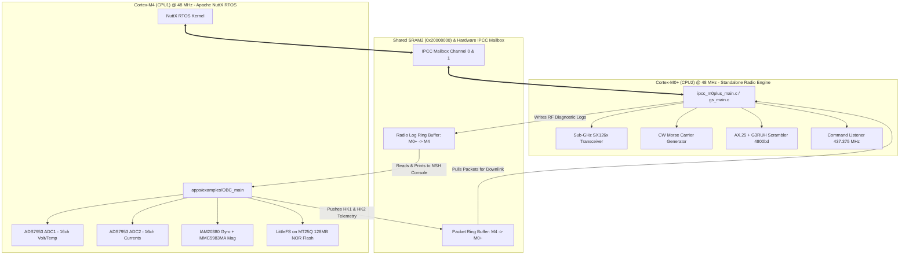

# STM32WL55 Dual-Core Satellite On-Board Computer (OBC) & Ground Station (GS)

[](https://www.st.com/en/microcontrollers-microprocessors/stm32wl55jc.html)
[](https://nuttx.apache.org/)
[]()
[]()

## Run on any laptop (clone once, flash prebuilt bins)

Do **not** clone `main`. Prebuilt images and the working satellite/GS firmware are on **`working-firmware`**.

CW Morse can work from an old satellite M0+ image. **Uplink commands and ADC1/ADC2 do not.** Those need:

| Board | File | Address | UART banner |
|:---|:---|:---|:---|
| Satellite M4 | `nuttx/nuttx.bin` | `0x08000000` | `[BOOT] obc_main auto-started ... ADC1+ADC2+IMU` |
| Satellite M0+ | `Satellite_M0+/Com_sat/satellite.bin` | `0x08032000` | `FW-ID: SAT-G3RUH-UPLINK7` |
| Ground Station M0+ | `Ground_Station/gs_m0plus.bin` | `0x08032000` | `FW-ID: GS-G3RUH-20261006` |

```bash
git clone -b working-firmware https://github.com/PrmBRana/dummy-camera-live.git
cd dummy-camera-live
pip3 install -r Ground_Station/requirements.txt

# 1) Plug ONLY the satellite Nucleo, then:
python3 tools/flash.py satellite

# 2) Unplug satellite. Plug ONLY the ground-station Nucleo, then:
python3 tools/flash.py gs

# 3) GUI talks to the GS COM port (not the satellite COM)
python3 Ground_Station/gs_communicator.py
```

Linux with `make` and STM32CubeProgrammer:

```bash
make flash_all_sat    # M4 + satellite M0+  (ADC1/ADC2 + uplink RX)
make flash_GS         # ground station only
```

`make flash_sat` flashes **M0+ radio only**. That is why CW works but ADC1/ADC2 and some commands fail — you still need `make flash_all_sat`.

Satellite UART must say `CW telemetry source: LIVE (M4 ADC1/ADC2/IMU)`, not `DEFAULT`. Send HK/camera **after CW**, during LISTEN on **437.375 MHz**.

Never flash `satellite.bin` onto the GS board.

---

A complete, production-grade flight firmware and ground station architecture for the **STM32WL55JC** dual-core SoC (Cortex-M4 + Cortex-M0+). 

- **CPU1 (Cortex-M4)** runs **Apache NuttX RTOS**, managing sensor telemetry acquisition (dual 16-channel SPI ADCs, 6-axis IMU/magnetometer), external NOR flash storage formatted with **LittleFS**, and inter-core communication.
- **CPU2 (Cortex-M0+)** runs a dedicated, high-performance bare-metal **Sub-GHz radio coprocessor**, driving the embedded SX126x radio engine for **+22 dBm CW Morse beacons**, **4800-baud GMSK AX.25 + G3RUH** telemetry downlinks, and continuous **telecommand uplink listening**.
- **Ground Station (GS)** standalone mode supports automated reception and physical-unit decoding of Beacon 1 (voltages & temperatures) and Beacon 2 (currents & attitude), along with telecommand uplinks (`CAMERA`, `ADCS`, `EPDM`, `BURST`).

---

## Table of Contents
1. [System Architecture](#1-system-architecture)
2. [Memory Map & Partitioning](#2-memory-map--partitioning)
3. [CPU1 (Cortex-M4): NuttX RTOS & Sensors](#3-cpu1-cortex-m4-nuttx-rtos--sensors)
4. [External NOR Flash & LittleFS](#4-external-nor-flash--littlefs)
5. [Shared SRAM2 Dual-Ring Buffer & IPCC](#5-shared-sram2-dual-ring-buffer--ipcc)
6. [CPU2 (Cortex-M0+): Sub-GHz Radio Coprocessor](#6-cpu2-cortex-m0-sub-ghz-radio-coprocessor)
7. [Flight Transmission Cadence](#7-flight-transmission-cadence)
8. [Ground Station (GS) Mode](#8-ground-station-gs-mode)
9. [Build and Flash Guide](#9-build-and-flash-guide)
10. [Serial Console & CuteCom Setup](#10-serial-console--cutecom-setup)

---

## 1. System Architecture



---

## 2. Memory Map & Partitioning

### On-Chip Flash Memory (256 KB Total)
The STM32WL55 internal flash consists of 128 hardware sectors (2 KB each).

| Region | Owner | Flash Range | Sectors | Size | Purpose |
|:---|:---:|:---:|:---:|:---:|:---|
| **CPU1 Application** | Cortex-M4 | `0x08000000 - 0x08031FFF` | `0 - 99` | **200 KB** | NuttX kernel, drivers, LittleFS, OBC application |
| **CPU2 Application** | Cortex-M0+ | `0x08032000 - 0x0803FFFF` | `100 - 127` | **56 KB** | Standalone Radio Coprocessor (`ipcc_m0plus.bin` or `gs_m0plus.bin`) |

> **Flash Independence**: Erasing CPU2 sectors `[100 127]` never touches CPU1 sectors `[0 99]`. Both cores can be built and flashed independently or combined into a single binary.

### RAM Memory Allocation (64 KB Total)
| RAM Block | Address Range | Size | Allocation |
|:---|:---:|:---:|:---|
| **SRAM1** | `0x20000000 - 0x20007FFF` | 32 KB | CPU1 (Cortex-M4) dedicated RAM for NuttX OS heap & stacks |
| **SRAM2 (Shared)** | `0x20008000 - 0x2000BFFF` | 16 KB | Lock-free Dual-Ring Buffers for M4 $\leftrightarrow$ M0+ IPCC Inter-Core IPC |
| **SRAM2 (CPU2)** | `0x2000C000 - 0x2000FFFF` | 16 KB | CPU2 (Cortex-M0+) dedicated RAM for radio stack & packet buffers |

---

## 3. CPU1 (Cortex-M4): NuttX RTOS & Sensors

### Boot Flow (`stm32_boot.c`)
1. **Clock Configuration**: 48 MHz system clock derived from the 32 MHz TCXO HSE via PLL.
2. **External Flash Mount**: Initializes SPI1 MT25Q NOR Flash and creates block drivers.
3. **CPU2 Boot Activation**:
   - Pre-enables peripheral clocks: `C2AHB2ENR` (GPIOA, GPIOB, GPIOC) and `C2AHB3ENR` (IPCC, SRAM2).
   - Writes `PWR_CR4_C2BOOT` to boot Cortex-M0+ at `0x08032000`.
4. **ADC Registration**: Registers SPI2 ADS7953 ADC1 (`/dev/adc0`) and ADC2 (`/dev/adc1`).
5. **NuttShell (NSH)**: Starts interactive command-line interface on `/dev/console` (115200 baud).

### Dual ADS7953 SPI ADC Drivers
- **SPI Bus**: SPI2 (`PB13` SCK, `PB14` MISO, `PB15` MOSI).
- **ADC 1 (`/dev/adc0`, CS: `PC1`)**: Scans 16 channels:
  - CH00: `ADC_BAT_MON` (Battery Voltage)
  - CH01: `TOTAL_SOLAR_V` (Total Solar Bus Voltage)
  - CH02: `RAW_VOLT` (Raw Bus Voltage)
  - CH03–CH07: `SP1_V` through `SP5_V` (Solar Panels 1–5 Voltages)
  - CH08: `ANT_DEP_TEMP` (Antenna Deployment Temperature)
  - CH09: `BATT_TEMP` (Battery NTC Temperature)
  - CH10: `TEMP_BPB` (Backplane Board Temperature)
  - CH11–CH15: `TEMP1` through `TEMP5` (Onboard Thermistors)
- **ADC 2 (`/dev/adc1`, CS: `PC2`)**: Scans 16 channels:
  - CH01: `UNREG_I` (Unregulated Bus Current)
  - CH02: `SP4_I`, CH09: `SP2_I`, CH10: `SP1_I`, CH13: `SP5_I`, CH15: `SP3_I` (Solar Panel Currents)
  - CH03: `MAIN_3V3_I` (Main 3.3V Current)
  - CH05: `MISSION_3V3_I` (Payload 3.3V Current)
  - CH06: `SPT_I` (Sun Pointing Current)
  - CH08: `5V_I` (5V Regulated Bus Current)
  - CH11: `RAW_I` (Raw Bus Total Current)
  - CH14: `BAT_I` (Battery Charge/Discharge Current)

### Inertial & Magnetic Sensors
- **IAM20380**: 3-Axis digital gyroscope on SPI2 (`/dev/imu0`), providing angular rates in degrees/second ($\text{dps}$).
- **MMC5983MA**: 3-Axis high-precision digital magnetometer on SPI2 (`/dev/mag0`), providing magnetic field measurements in Gauss ($\text{G}$).

### Telemetry Packaging (`OBC_main/main.c`)
- **Beacon 1 (HK1: 34 Bytes)**: Packs all 16 ADC1 voltage and temperature readings (16-bit uint16 each) + 2-byte footer `0xAA55`.
- **Beacon 2 (HK2: 38 Bytes)**: Packs 12 current channels (uint16) + 3-axis gyro (uint16 each) + 3-axis magnetometer (uint16 each) + 2-byte footer `0xBB66`.

---

## 4. External NOR Flash & LittleFS

The board integrates a **Micron MT25QL01G** 1 Gbit / 128 MB SPI NOR Flash operated via SPI1 (`PA5`, `PA6`, `PA7`, `PD10` CS).

### Flash Partition Layout
```
+---------------------------+---------------------------+---------------------------------------+
|  /dev/hk1 (32 MB, Die 0)  |  /dev/hk2 (32 MB, Die 0)  |      /dev/camera (64 MB, Die 1)       |
|   Blocks: 0 - 131071      |  Blocks: 131072 - 262143  |        Blocks: 262144 - 524287        |
+---------------------------+---------------------------+---------------------------------------+
```

- **/dev/hk1 (32 MB)**: Formatted with **LittleFS**; stores historical Beacon 1 records.
- **/dev/hk2 (32 MB)**: Formatted with **LittleFS**; stores historical Beacon 2 records.
- **/dev/camera (64 MB)**: Raw high-speed storage partition for camera payload imagery.

**LittleFS Features**:
- Power-loss resilience (atomic transaction logging; survives unexpected brownouts or resets).
- Dynamic wear leveling across the entire 32 MB partition span.
- Bad-block detection and management.

---

## 5. Shared SRAM2 Dual-Ring Buffer & IPCC

Inter-core communication is entirely lock-free, implemented in **Shared SRAM2** (`0x20008000`):

```
Shared SRAM2 (0x20008000)
├── Magic Identifier (0x5352494E / "SRIN")
├── Shared Control Structure (Lock-free atomic head/tail indices)
├── Packet Ring Buffer (tx_ring): M4 -> M0+ (Holds up to 8 x 80-byte packets)
└── Radio Log Ring Buffer (log_ring): M0+ -> M4 (Holds up to 16 x 88-byte log lines)
```

### Protocol Flow
1. **M4 $\rightarrow$ M0+ (Downlink Telemetry)**:
   - `OBC_main` writes an HK1 or HK2 packet to `tx_ring` via `ring_buffer_write()`.
   - M4 signals IPCC Channel 0.
   - M0+ receives the notification, extracts the packet, wraps it in an AX.25 frame, applies G3RUH scrambling, and transmits over RF.
2. **M0+ $\rightarrow$ M4 (Radio Debug Logs)**:
   - M0+ writes diagnostic events (`radio_log_write()`) such as CW start, beacon transmission, RSSI, and errors.
   - M4 continuously polls `radio_log_read()` in `OBC_main` and prints them directly to the console terminal.
3. **Hardware IPCC Mailbox**:
   - Channel 0: M4 to M0+ packet-ready signal.
   - Channel 1: M0+ to M4 transmission-complete acknowledgment.

---

## 6. CPU2 (Cortex-M0+): Sub-GHz Radio Coprocessor

### Radio Architecture & Configuration
The Cortex-M0+ manages the built-in Semtech **SX126x** radio transceiver directly through the internal Sub-GHz SPI3 bus:

- **TX Downlink Frequency**: **`435.000 MHz`** (+22 dBm high-power PA)
- **RX Uplink Frequency**: **`437.375 MHz`**
- **Modulation**: GMSK / GFSK
- **Bitrate**: **`4800 baud`** (`4800 bps`)
- **Frequency Deviation**: `1200 Hz` ($h = 0.5$ modulation index)
- **RX Bandwidth Filter**: `23.4 kHz` (`23400 Hz`)
- **Preamble**: `128 bits` (16 bytes)
- **Scrambling**: Standard **G3RUH** polynomial ($1 + x^{12} + x^{17}$)
- **Framing**: Amateur radio standard **AX.25 UI-Frames** (Source: `NEPSAT-1`, Dest: `GROUND-0`)

### Persistent TCXO Clocking (Cold-Start Fix)
- **Problem**: Powering down the radio into `STDBY_RC` shuts down the 32 MHz TCXO power rail (DIO3). SX126x requires a 100 ms stabilization timeout when waking from `STDBY_RC`, which completely clipped 80 ms Morse dots.
- **Solution**: The radio operates in **`STDBY_XOSC`** mode during CW pauses. The 32 MHz oscillator stays continuously active, allowing the PLL to lock in **$< 40\ \mu\text{s}$** and radiating full RF energy on all Morse dots and dashes.

---

## 7. Flight Transmission Cadence

The satellite firmware executes a continuous, deterministic flight cycle with **zero extra delay**:

$$\mathbf{CW\;(90s)} \longrightarrow \mathbf{B1\;(Once)} \longrightarrow \mathbf{CW\;(90s)} \longrightarrow \mathbf{B2\;(Once)} \longrightarrow \mathbf{CW\;(90s)} \dots$$

```
+---------------------------------------------------------------------------------+
|  1. Continuous CW Morse Beacon (90 Seconds)                                     |
|     Frequency: 435.000 MHz | Power: +22 dBm | Speed: ~15 WPM                     |
|     Message: "9NS2S2 V<batt_v> T<sat_temp>" (e.g. "9NS2S2 V3.86 T21.0")          |
+---------------------------------------------------------------------------------+
                                      │
                                      ▼ (Immediate - 0 ms delay)
+---------------------------------------------------------------------------------+
|  2. Beacon 1 (HK1: 34 Bytes) Downlink                                           |
|     Frequency: 435.000 MHz | 4800 baud GMSK AX.25 + G3RUH                       |
|     Count: Exactly 1 Time (1x)                                                  |
+---------------------------------------------------------------------------------+
                                      │
                                      ▼ (Immediate - 0 ms delay)
+---------------------------------------------------------------------------------+
|  3. Continuous CW Morse Beacon (90 Seconds)                                     |
|     Frequency: 435.000 MHz | Power: +22 dBm | Speed: ~15 WPM                     |
+---------------------------------------------------------------------------------+
                                      │
                                      ▼ (Immediate - 0 ms delay)
+---------------------------------------------------------------------------------+
|  4. Beacon 2 (HK2: 38 Bytes) Downlink                                           |
|     Frequency: 435.000 MHz | 4800 baud GMSK AX.25 + G3RUH                       |
|     Count: Exactly 1 Time (1x)                                                  |
+---------------------------------------------------------------------------------+
                                      │
                                      └───► (Repeats continuously)
```

---

## 8. Ground Station (GS) Mode

The same codebase can be compiled into dedicated Ground Station firmware (`gs_m0plus.bin`):

- **Continuous Listening**: Listens on **`435.000 MHz`** for incoming satellite transmissions.
- **Automated Physical Unit Decoding**:
  - **Beacon 1 (HK1)**: Decodes all 16 voltages (in Volts) and temperatures (in °C); verifies `0xAA55` footer.
  - **Beacon 2 (HK2)**: Decodes all 12 currents (in Amperes) and 6-axis IMU/Mag data (in $\text{dps}$ and Gauss); verifies `0xBB66` footer.
  - **Satellite Response**: Automatically parses Command `ACK` (`0xAA`) and `NACK` (`0x55`).
- **Telecommand Uplink Terminal (437.375 MHz)**:
  - `CAM` / `CAMERA`: Uplinks 13-byte Camera Run Command burst (`0x53, 0x04, 0xCC, 0x5E, 0xBD...`).
  - `ADCS`: Uplinks 13-byte ADCS Subsystem Command (`Opcode 0x03`).
  - `EPDM`: Uplinks 13-byte EPDM Payload Command (`Opcode 0x05`).
  - `BURST`: Requests 100-packet telemetry burst (`Opcode 0x01`).

---

## 9. Build and Flash Guide

### Prerequisites
- ARM GNU Toolchain (`arm-none-eabi-gcc`)
- STMicroelectronics `STM32_Programmer_CLI` (or OpenOCD)

### Building the Binaries

From the repository root (any laptop; not `/home/prem/...`):

```bash
# 1. Build CPU1 Cortex-M4 (NuttX OBC) — optional; nuttx/nuttx.bin is already in git
cd nuttx
make -j4
# Produces: nuttx/nuttx.bin

# 2. Build CPU2 Cortex-M0+ Satellite Flight Firmware
cd ../Satellite_M0+/Com_sat
make -j4
# Produces: satellite.bin

# 3. Build CPU2 Cortex-M0+ Ground Station Firmware
cd ../../Ground_Station
make -j4
# Produces: gs_m0plus.bin
```

### Flashing via Make Targets (Independent Core Flashing)

Both cores can be flashed **completely independently** in any order. Flashing CPU1 erases only sectors 0–99 (leaving CPU2 at `0x08032000` intact). Flashing CPU2 erases only sectors 100–127 (leaving CPU1 at `0x08000000` intact).

From the repository root:

```bash
# Friends / any laptop: flash satellite M4+M0+ so ADC1/ADC2 and uplink work
make flash_all_sat

# M0+ radio only (CW works, ADC1/ADC2 will NOT):
make flash_sat

# Ground station M0+:
make flash_GS
```

From inside the `nuttx/` directory:
```bash
# Flash CPU1 only:
make flash
# (or 'make flash_cpu1')

# Flash CPU2 from nuttx directory:
make flash_sat
make flash_gs
```

### Manual Flashing via `STM32_Programmer_CLI`

> [!WARNING]
> **DO NOT use Mass Erase (`-e all`)!** Mass erase will wipe both cores simultaneously. The `-w` parameter performs sector-level erasure only for the target core's address space.

```bash
# Flash CPU1 (M4 NuttX OBC) to 0x08000000 (Sectors 0 - 99):
STM32_Programmer_CLI -c port=SWD -w nuttx/nuttx.bin 0x08000000 -v -hardRst

# Flash CPU2 (M0+ Satellite Radio) to 0x08032000 (Sectors 100 - 127):
STM32_Programmer_CLI -c port=SWD -w CPU2/ipcc_m0plus.bin 0x08032000 -v -hardRst

# Flash CPU2 (M0+ Ground Station) to 0x08032000 (Sectors 100 - 127):
STM32_Programmer_CLI -c port=SWD -w CPU2/gs_m0plus.bin 0x08032000 -v -hardRst
```

### Manual Flashing via `OpenOCD`

```bash
# Flash CPU1 (M4 NuttX OBC) to 0x08000000:
openocd -f interface/stlink.cfg -f target/stm32wlx.cfg \
  -c "init" -c "targets" -c "reset halt" -c "flash probe 0" \
  -c "program nuttx/nuttx.bin 0x08000000 verify" \
  -c "reset run" -c "exit"

# Flash CPU2 (M0+ Satellite Radio) to 0x08032000:
openocd -f interface/stlink.cfg -f target/stm32wlx.cfg \
  -c "init" -c "targets" -c "reset halt" -c "flash probe 0" \
  -c "program CPU2/ipcc_m0plus.bin 0x08032000 verify" \
  -c "reset run" -c "exit"
```

---

## 10. Serial Console & CuteCom Setup

Connect your board to the computer via the onboard ST-LINK micro-USB connector.

| Parameter | Value |
|:---|:---|
| **Port** | `/dev/ttyACM0` (Linux) |
| **Baud Rate** | **`115200 bps`** |
| **Data Bits** | `8` |
| **Stop Bits** | `1` |
| **Parity** | `None` |
| **Flow Control** | `None` |
| **Line Ending** | `CR/LF` |

### Terminal Verification
Once booted, the terminal displays:
```text
Initializing external MT25Q NOR Flash...
MT25Q JEDEC ID: Mfg=0x20, Type=0xBA, Cap=0x21
Detected Micron MT25QL01G (1 Gbit / 128 MB)
Registered /dev/hk1 (32 MB - Die 0)
Registered /dev/hk2 (32 MB - Die 0)
Registered /dev/camera (64 MB - Die 1)
[SYSTEM] Booting Cortex-M0+ (CPU2) at 0x08032000 (M4: 200KB, M0+: 56KB)...
ADS7953 ADC1 registered at /dev/adc0
ADS7953 ADC2 registered at /dev/adc1

NuttShell (NSH) NuttX-12.13.0
nsh>
```

Start telemetry acquisition by running:
```bash
nsh> OBC_main &
```
Telemetry scans and real-time M0+ radio logs will begin streaming immediately.
